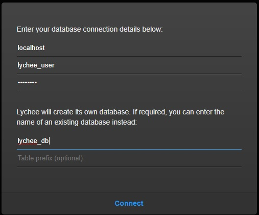
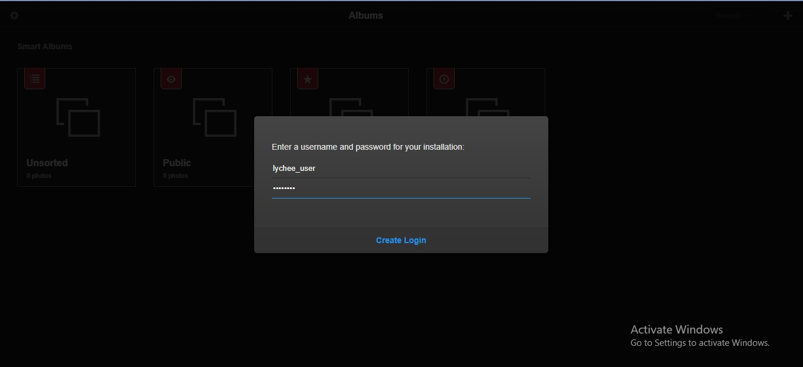
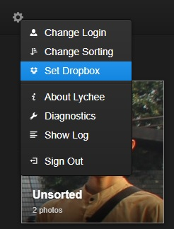
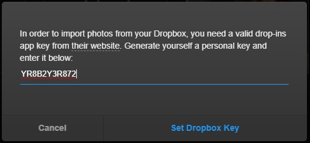
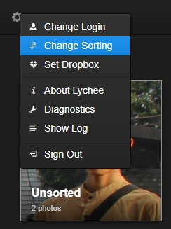
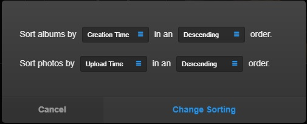

<h1 align="center"></h1>

[Sekilas Tentang](#sekilas-tentang) | [Instalasi](#instalasi) | [Konfigurasi](#konfigurasi) | [Otomatisasi](#otomatisasi) | [Cara Pemakaian](#cara-pemakaian) | [Pembahasan](#pembahasan) | [Referensi](#referensi)
:---:|:---:|:---:|:---:|:---:|:---:|:---:


# Sekilas Tentang
[`^ kembali ke atas ^`](#)

**Lychee** adalah sebuah alat manajemen foto (*photo management tool*) gratis, yang berjalan di *server* maupun *web-space* anda. Proses pemasangan atau instalasi dapat dilakukan dalam hitungan detik. Kemudahan yang ditawarkan dari perangkat lunak ini adalah mengunngah, mengatur, dan membagikan foto seperti pada aplikasi *native*. **Lychee** hadir dengan segala kebutuhan pengguna dan semua foto akan disimpan dengan aman. **Lychee** dikembangkan oleh Tobias Reich, seorang pengembang *website* yang berasal dari Frankfurt, Jerman.


# Instalasi
[`^ kembali ke atas ^`](#)

#### Kebutuhan Sistem :
- Unix, Linux atau Windows
- Apache Web server 1.3+
- PHP 5.5+
- MySQL 5.0+
- Menambahkan aturan pada *file* php.ini:
  ```
  max_execution_time = 200
  post_max_size = 100M
  upload_max_size = 100M
  upload_max_filesize = 20M
  memory_limit = 256M
  ```

#### Proses Instalasi :
1. Login kedalam server menggunakan SSH
    ```
    $ ssh student@localhost -p 2200
    ```

2. Memastikan aplikasi prasyarat telah ada dan menggunakan versi terbaru
    ```
    $ sudo tee /etc/apt/sources.list << !
    > deb http://repo.apps.cs.ipb.ac.id/ubuntu bionic          main restricted universe multiverse
    > deb http://repo.apps.cs.ipb.ac.id/ubuntu bionic-updates  main restricted universe multiverse
    > deb http://repo.apps.cs.ipb.ac.id/ubuntu bionic-security main restricted universe multiverse
    > !
    $ sudo apt update
    $ sudo apt install apache2 php mysql-server
    $ sudo apt install php-mysql php-gd php-mbstring php-xml php-curl
    $ sudo service apache2 restart
    ```
3. Membuat *database* yang akan digunakan untuk aplikasi Lychee
    ```
    $ sudo mysql -u root -p
    > CREATE DATABASE lychee_db CHARACTER SET utf8 COLLATE utf8_general_ci;
    > CREATE USER 'lychee_user'@'localhost' IDENTIFIED BY 'password';
    > GRANT ALL PRIVILEGES ON lychee_db.* TO 'lychee_user'@'localhost';
    > FLUSH PRIVILEGES;
    > EXIT;
    ```

4. Melakukan `gitclone` untuk memasang aplikasi Lychee pada server kita
    ```
    $ cd /var/www/html/
    $ sudo chmod 777 /var/www/html/
    $ git clone https://github.com/electerious/Lychee.git
    
    ```

5. Ganti *permission* sesuai dengan yang dibutuhkan
    ```
    $ cd /var/www/html/Lychee
    $ chmod -R 750 uploads/ data/
    ```

5. Ubah otorisasi kepemilikan ke user www-data (webserver)
    ```
    $ sudo chown -R www-data:www-data /var/www/html/prestashop
    ```
    
6. Restart kembali Apache web server.
    ```
    $ sudo service apache2 restart
    ```

7. Kunjungi alamat IP web server kita untuk meneruskan instalasi.
    - Secara *default* dapat mengunjungi `http://localhost:8000/Lychee/`
    
    - Silakan masukan nama *host*, *username*, dan *password* untuk mengakses *database* anda, serta tulis juga nama *database*-nya <br/>
      

    - Buat *username* dan *password* untuk melakukan *log in*
      


# Konfigurasi
[`^ kembali ke atas ^`](#)

- Untuk meningkatkan kinerja dan memastikan aplikasi berjalan lancar, silakan merubah isi file `etc/php/7.0/apache2/php.ini` dan tambahkan baris berikut :
    ```
    max_execution_time = 200
    post_max_size = 100M
    upload_max_size = 100M
    upload_max_filesize = 20M
    memory_limit = 256M

- Agar foto yang dirotasi tidak kehilangan metadata-nya, silakan *install* imagick melalui terminal:
    ```
    $ sudo apt-get install php-imagick
    $ php -m | grep imagick
    $ sudo service apache2 restart
    ```

- Untuk membuat dapat mengupload file dari Dropbox, silakan konfigurasi Dropbox anda melalui tombol gir yang ada di pojok kiri atas,       lalu mengisikan *app key* yang valid dari website Dropbox <br/>
   <br/>
  

- Silakan mengganti urutan (*sorting*) album dan foto sesuai dengan parameter yang diinginkan
   <br/>
  


# Maintenance
[`^ kembali ke atas ^`](#)

Sebelum melakukan perubahan dan bahkan untuk berjaga-jaga agar foto kita memiliki cadangan, berikut cara yang dapat dilakukan untuk membuat *back up* foto pada Lychee:
  1. Buat *copy* dari semua folder Lychee
  2. Jalankan *query* MySQL berikut:
      ```
      > CREATE TABLE lychee_albums_backup LIKE lychee_albums;
      > INSERT INTO lychee_albums_backup SELECT * FROM lychee_albums;
      > CREATE TABLE lychee_photos_backup LIKE lychee_photos;
      > INSERT INTO lychee_photos_backup SELECT * FROM lychee_photos;
      > CREATE TABLE lychee_settings_backup LIKE lychee_settings;
      > INSERT INTO lychee_settings_backup SELECT * FROM lychee_settings;
      ```


# Otomatisasi
[`^ kembali ke atas ^`](#)

Jika kalian masih merasa kesulitan dalam meng-install **Lychee**, terdapat cara yang lebih mudah untuk itu, yakni dengan menggunakan `script shell` yang otomatis akan menjalankan semua perintah instalasi pada terminal. Contoh `script shell` yang dapat kita gunakan adalah [shell.sh](../master/shell.sh)


# Cara Pemakaian
[`^ kembali ke atas ^`](#)

Penggunaan **Lychee** adalah seperti *software* manajemen foto yang biasa kita lakukan di *smartphone*, dan bahkan dapat digunakan dengan lebih mudah, intuitif, dan responsif. Berikut beberapa fitur dasar yang dapat dilakukan:
1. *Log in* dengan meng-klik tombol `log in` di pojok kiri atas, lalu masukkan *username* dan *password* anda
2. *Upload* foto dengan tombol '+' yang ada di pojok kanan atas, pilih "*Upload Photo*", lalu pilih foto mana yang akan di-*upload* (bisa lebih dari satu)
3. Melihat detail foto dengan cara meng-klik foto yang dimaksud, lalu klik simbol `i` yang ada di kanan atas
4. 
    
    

# Pembahasan
[`^ kembali ke atas ^`](#)

**Lychee** memberikan pelayanan manajemen foto yang mudah, simpel, dan *lightweight* sebagai alternatif penyimpanan foto lainnya seperti iCloud, Google Photos, dan Piwigo. Secara umum, kelebihan yang dimiliki **Lychee** adalah:
  - Ringan, sehingga dapat dijalankan dengan mudah pada komputer dengan kemampuan kecil
  - GUI intuitif yang sangat *user-friendly* sehingga pengguna baru tidak perlu membaca petunjuk penggunaan, karena sebagian besar *taskflow*-nya sama dengan sistem manajemen foto pada umumnya.
  - Memberikan privasi pada pengguna sehingga dapat mengatur sebuah album atau foto menjadi *private* maupun *public*
  - Kemudahan mengakses metadata dan mode *display* foto yang menarik
  - Pemberian 'tag' yang dapat memudahkan pengguna mencari suatu jenis foto tertentu

Di sisi lain, aplikasi Lychee juga memiliki kekurangan, antara lain:
  - Belum mengintegrasi *Google Drive* sebagai salah satu sumber direktori untuk melakukan *upload* foto
  - Hanya terbatas pada manajemen foto, sehingga tidak memungkinkan untuk menyimpan video

Pembanding yang setara dan sering didiskusikan adalah **Piwigo**. Berikut beberapa pendapat kami mengenai kedua software ini:
- **Piwigo** memiliki nilai tambah dari segi fungsionalitas, namun tampilan aplikasi **Piwigo** sendiri terkesan lama, kurang responsif, dan tidak *user-friendly*
- Tampilan utama **Lychee** lebih indah dilihat dan memiliki kesan pertama yang baik
- Meskipun tidak memiliki kolom komentar seperti **Piwigo**, aplikasi **Lychee** tetap memiliki keunggulan karena tujuan utamanya merupakan sebagai manajemen foto yang dapat menampilkan gambar dengan baik.
- Kami cenderung lebih sulit memahami fungsi-fungsi yang ada di **Piwigo** dikarenakan tampilan UI-nya yang terkesan aneh dan berbeda dengan *software* manajemen foto pada umumnya


# Referensi
[`^ kembali ke atas ^`](#)

1. [Lychee &mdash; Self-hosted photo-management done right](https://lychee.electerious.com/) - Electerious
2. [Web Developer and Designer | Electerious](https://electerious.com/) - Electerious
3. [electerious/Lychee: A great looking and easy-to-use photo-management-system you can run on your server, to manage and share photos.](https://github.com/electerious/Lychee/) - GitHub
4. [How to Install Lychee 3.1 Photo Album on an Ubuntu 16.04 LAMP VPS - Vultr.com](https://www.vultr.com/docs/how-to-install-lychee-3-1-photo-album-on-an-ubuntu-16-04-lamp-vps/) - Vultr
5. [How to install Imagick for PHP 7 in Ubuntu 16.04  | Our Code World](https://ourcodeworld.com/articles/read/645/how-to-install-imagick-for-php-7-in-ubuntu-16-04/) - Our Code World
6. [Lychee – A Great Looking Photo Management System for Linux](https://www.tecmint.com/lychee-photo-management-system-for-linux/) - TecMint
7. [Lychee vs Piwigo - self-hosted photo backup and management](https://www.reddit.com/r/selfhosted/comments/b28ib2/lychee_vs_piwigo_selfhosted_photo_backup_and/) - Reddit
8. [Piwigo VS Lychee](https://www.saashub.com/compare-piwigo-vs-lychee) - SaaSHub
